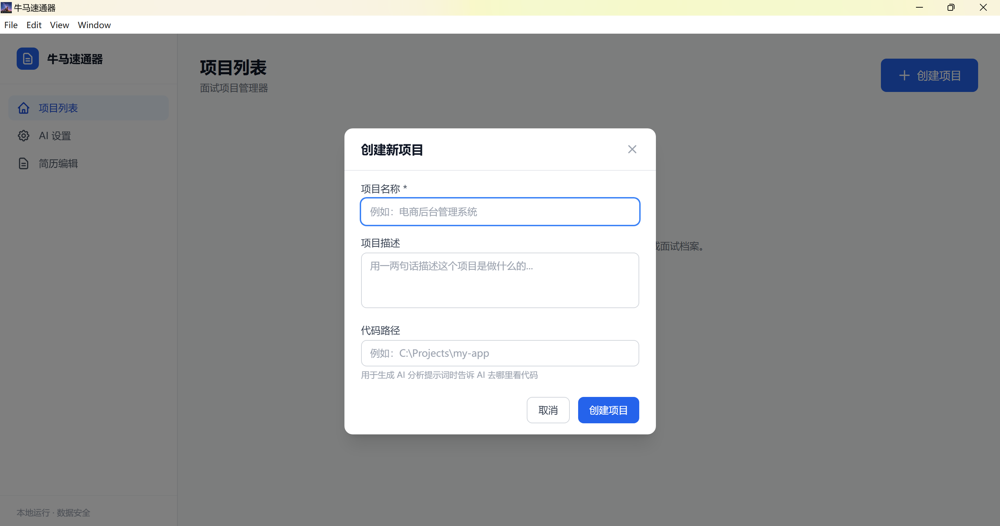
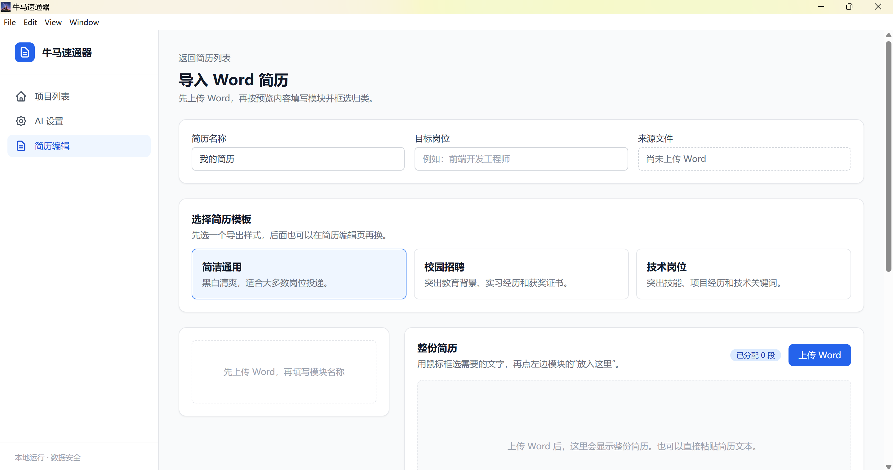

# 牛马速通器

一款基于 Electron + Next.js 的桌面应用，主要用来整理本地项目代码、自动生成项目分析资料，并辅助用户快速回顾自己做过的项目，准备技术面试。

它的核心不是“做一个花哨的简历工具”，而是帮你把项目资料、AI 分析结果、面试问答和简历内容放到一起，减少反复翻代码、重新回忆项目细节的麻烦。简历编辑和导出是辅助功能，目的是让项目材料能更顺手地整理成可用内容。

## 这个项目适合谁

- 做过项目，但面试时总是记不清细节的人
- 用 AI 辅助开发过项目，想把过程和亮点整理出来的人
- 想把项目代码快速整理成面试档案的人
- 需要把项目内容进一步写进简历的人

## 核心功能

### 1. 项目管理

- 创建、编辑、删除项目
- 记录项目名称、代码路径、备注等信息
- 支持按项目状态查看是否已经分析过

### 2. AI 自动分析

- 读取本地项目源码
- 调用 OpenAI-compatible API 自动分析项目
- 生成结构化分析结果，包含：
  - 项目概览
  - 技术栈
  - 关键文件说明
  - 面试问题
  - 建议回答
  - 可写进简历的项目亮点
- 支持分析历史，方便保留多个版本

### 3. AI 设置

- 支持配置 `Base URL`
- 支持配置 `API Key`
- 支持配置 `Model`
- 适配 OpenAI、DeepSeek 以及其他兼容 OpenAI 接口风格的模型服务
- 配置会保存在本地，不需要单独部署数据库服务

### 4. 简历编辑

- 导入 Word 简历后进行结构化编辑
- 支持模块名称、内容、顺序、照片、目标岗位等内容调整
- 支持多套简历模板
- 支持选择 1 页 / 2 页 / 3 页等目标页数
- 支持 AI 项目经历助手，辅助生成项目经历内容

### 5. 导入与导出

- 导入 `.docx` 简历
- 按模块整理内容
- 导出 Word 和 PDF
- PDF 会尽量保留模板排版和照片
- Word 导出为普通版，**不能保证完全还原原始 Word 模板格式**

## 使用流程

1. 创建项目，填写项目路径和基础信息
2. 配置 AI 设置
3. 运行 AI 自动分析，生成项目资料
4. 查看分析结果、面试问题和项目亮点
5. 导入 Word 简历，整理模块内容
6. 选择模板、页数、照片和目标岗位
7. 导出为 PDF 或 Word

## 技术栈

- Electron
- Next.js 15
- React 19
- TypeScript
- Tailwind CSS
- SQLite / better-sqlite3
- mammoth
- docx

## 目录结构

```bash
.
├── electron/          # Electron 主进程、启动逻辑、服务管理
├── src/               # Next.js 前端、页面、组件、API
├── assets/            # 图标等资源
├── database/          # 本地 SQLite 数据
├── test/              # 单元测试
└── release/           # 打包输出
```

## 本地开发

### 安装依赖

```bash
npm install
```

### 启动开发版

```bash
npm run electron:dev
```

### 运行测试

```bash
npm test
```

### 构建生产版

```bash
npm run build
```

### 打包安装程序

```bash
npm run dist
```

打包后的安装文件会生成在 `release/` 目录。

## 说明

- 数据默认保存在本地，不依赖外部数据库服务
- 图片、简历和项目数据都在本机处理
- 如果遇到 `better-sqlite3` 相关报错，先执行 `npm rebuild better-sqlite3`
- 如果项目代码较大，AI 自动分析可能会更慢，必要时可以缩小分析范围

## 截图



## 许可证

MIT
